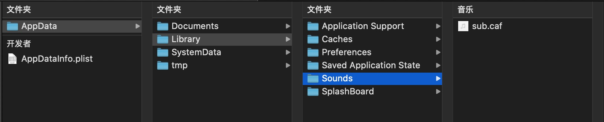

# APNs 整理

## 服务器请求相关


## 客户端相关


### APNs 格式说明


 key | 类型 |  说明
----|----|----
alert | Dictionary (or String) | 内容
badge | Number | 角标
sound | String | 声音
sound | Dictionary | 用于细化声音提示
thread-id | String | 推送展示分组
category | String | 自定义事件
content-available | Number | 静默推送
mutable-content | Number | 唤醒Apns Service Extension,值为 0 or 1
target-content-id| String | 推送content id

#### alert 是String


```
{
	"aps": {
		"alert": "我是alert String",	// 显示内容
		"badge": 11116,	// 角标
		"sound": "default"	// 声音
	}
}

```


#### alert 是Dictionary


```
{
	"aps": {
		"alert": {
			"title":"我是title",
			"subtitle":"我是subtitle",
			"body":"我是body"
		},
		"badge": 11116,
		"sound": "default"
	}
}
```


#### 国际化


客户端中配置要对应的国际化文件，Apns直接使用对应的key推送


客户端配置1：

```
// zh
"hello"="你好!";

// en
"hello"="hello!";
```


```
{
	"aps": {
		"alert": {
			"loc-key":"hello"
		},
		"badge": 1,
		"sound": "default"
	}
}

```

客户端配置2：

```
// zh
"title"="标题!";
"subtitle"="子标题!";
"body"="内容!";

// en
"title"="title!";
"subtitle"="subtitle!";
"body"="body!";

```


```
{
	"aps": {
		"alert": {
			"title-loc-key":"title",
			"subtitle-loc-key":"subtitle",
			"loc-key":"body"
		},
		"badge": 11116,
		"sound": "default"
	}
}

```


#### sound是String


```
// 支持格式
Linear PCM
MA4 (IMA/ADPCM)
µLaw
aLaw

// 存放路径
AppData/Library/Sounds

```

音频文件在App中存放路径：



推送格式：

```
{
	"aps": {
		"alert": "我是alert String",
		"badge": 11116,
		"sound": "sub.caf" // 声音文件名称
	}
}
```


#### sound是Dictionary

key | 类型 | 说明
---|---|---
critical | Number | 是否设置为警告 0 or 1
name | String | 音频文件名称
volume | Number | 音量 0~1

<https://developer.apple.com/contact/request/notifications-critical-alerts-entitlement/>
这种证书需要单独申请并说明用途，推送的时候会有一个叹号，比如家里招贼了...

#### thread-id，用于推送展示时分组。


```
{
	"aps": {
		"alert": {
			"title":"测试推送合并",
			"subtitle":"我的thread-id是2",
			"body":"我会和其他thread-id是2的推送合并展示"
		},
		"badge": 11116,
		"sound": "default",
		"thread-id":"2"
	}
}
```


#### category 用于在不打开App的情况下处理

选项：


```
{
	"aps": {
		"alert": "我是alert String",
		"badge": 11116,
		"sound": "default",
		"category":"MEETING_INVITATION"
	}
}
```

客户端需要提前注册样式，代码：

```
- (void)updateNotificationCategory {
    
    UNNotificationAction *action1 = [UNNotificationAction actionWithIdentifier:@"ACCEPT_ACTION"
                                                                         title:@"Accept"
                                                                       options:UNNotificationActionOptionAuthenticationRequired];
    
    UNNotificationAction *action2 = [UNNotificationAction actionWithIdentifier:@"DECLINE_ACTION"
                                                                         title:@"Decline"
                                                                       options:UNNotificationActionOptionForeground];
    //给category设置action
    UNNotificationCategory *category1 = [UNNotificationCategory categoryWithIdentifier:@"MEETING_INVITATION"
                                                                               actions:@[action1, action2]
                                                                     intentIdentifiers:@[]
                                                                               options:UNNotificationCategoryOptionNone];
    //给通知内容设置category
    
    [UNUserNotificationCenter.currentNotificationCenter setNotificationCategories:[NSSet setWithObject:category1]];

}
```


输入：


```
{
	"aps": {
		"alert": "要不要去吃饭啊？",
		"badge": 11116,
		"sound": "default",
		"category":"INPUT"
	}
}

```

客户端需要提前注册样式，代码：

```
- (void)updateNotificationNTextCategory {
    UNTextInputNotificationAction *inputAction = [UNTextInputNotificationAction actionWithIdentifier:@"action.input"
                                                                                               title:@"输入"
                                                                                             options:UNNotificationActionOptionForeground
                                                                                textInputButtonTitle:@"发送"
                                                                                textInputPlaceholder:@"你可以输入文字"];
    // 注册 category
    UNNotificationCategory *category1 = [UNNotificationCategory categoryWithIdentifier:@"INPUT"
                                                                               actions:@[inputAction]
                                                                     intentIdentifiers:@[]
                                                                               options:UNNotificationCategoryOptionCustomDismissAction];
    
    UNUserNotificationCenter *center = [UNUserNotificationCenter currentNotificationCenter];
    [center setNotificationCategories:[NSSet setWithObject:category1]];
}
```


#### content-available 静默推送

收到后会被唤醒，主要是为了让App可以在后台时准备数据，用户打开App时可以直接展示从而提高用户体验。使用的前提是app在后台(不论是否在运行或者被挂起)，苹果官网已经不再建议使用。


```
{
   "aps" : {
      "content-available" : 1
   },
}

```


#### mutable-content 唤醒Apns Service Extension

ios10特性，为App创建Extension target. 可以通过mutable-content唤醒，执行对应代码，唤醒时间最长为30s，主要作用是用于下载展示时需要显示的图片或对推送做客户端本地处理(如昵称适配，国家化)，之后在推送时显示出来。


```
// "mutable-content"值必须为1，否则无法拦截
{
	"aps": {
        "alert":"我是消息",
        "badge":6,
        "mutable-content":1,
        "sound":"default"
    }
}

```


客户端代码

```
- (void)didReceiveNotificationRequest:(UNNotificationRequest *)request withContentHandler:(void (^)(UNNotificationContent * _Nonnull))contentHandler {
    self.contentHandler = contentHandler;
    self.bestAttemptContent = [request.content mutableCopy];
    
    self.bestAttemptContent.title = @"替换";
    self.bestAttemptContent.subtitle = @"替换";
    self.bestAttemptContent.body = @"替换";
    // music30.caf， 自定义铃声，铃声文件存放路径为 AppData/Library/Sounds，长度不得超过30秒
    self.bestAttemptContent.sound = [UNNotificationSound soundNamed:@"music30.caf"];
    self.contentHandler(self.bestAttemptContent);
}
```

ios12后，无法使用Extension__直接__播放声音和持续振动，微信，支付宝应该使用的是push kit, push kit 后文中说明


#### target-content-id 
UNNotificationContent对象的id，可以根据不同的id处理不同业务,如点击跳转到某个聊天页面(这个字段也可以自己定义，不一定非要使用字段，这个是字段可以直接从content中取到，如果不用这个字段，需要从content的userInfo里通过字典取)。


```
// 推送内容
{
	"aps": {
        "alert":"我是消息",
        "badge":6,
        "mutable-content":1,
        "target-content-id":"id_1"
    }
}
```


也可以用于通知的更新处理，

如: xxx正在呼叫您，当对方挂断后，提示"您有一个未接电话"


```
// "target-content-id" 关键字，但可以定义为其他字段
{
	"aps": {
        "alert":"du001正在邀请您进行语音通话",
        "badge":6,
        "mutable-content":1,
        "target-content-id":"du001_call_coming"
    }
}

```


```
// "need-delete-content-id"非关键字，可以定义为其他字段
{
	"aps": {
        "alert":"您有一个未接电话",
        "badge":6,
        "mutable-content":1,
        "need-delete-content-id":"du001_call_coming"
    }
}

```

ios 客户端代码

```
- (void)didReceiveNotificationRequest:(UNNotificationRequest *)request
                   withContentHandler:(void (^)(UNNotificationContent * _Nonnull))contentHandler {
    self.contentHandler = contentHandler;
    self.bestAttemptContent = [request.content mutableCopy];
    
    NSDictionary *aps = self.bestAttemptContent.userInfo[@"aps"];
    NSString *contentId = aps[@"need-delete-content-id"];
    __weak typeof(self) weakSelf = self;
    [self removeSingleNotification:contentId callBack:^{
        dispatch_after(dispatch_time(DISPATCH_TIME_NOW, (int64_t)(0.2 * NSEC_PER_SEC)), dispatch_get_main_queue(), ^{
            weakSelf.contentHandler(weakSelf.bestAttemptContent);
        });
    }];
}


- (void)removeSingleNotification:(NSString *)contentId
                        callBack:(void(^)(void))callBack{
    [[UNUserNotificationCenter currentNotificationCenter] getDeliveredNotificationsWithCompletionHandler:^(NSArray<UNNotification *> * _Nonnull notifications) {
        for (UNNotification *notification in notifications) {
            UNNotificationRequest *request = notification.request;
            UNNotificationContent *content = request.content;
            
            if ([content.targetContentIdentifier isEqualToString:contentId]) {
                [[UNUserNotificationCenter currentNotificationCenter] removeDeliveredNotificationsWithIdentifiers:@[request.identifier]];
            }
        }
        callBack();
    }];
}


```

__这个方式也可以用来做消息撤回，但contentHandler()执行时必须有返回，如果没有则表示本次拦截不被处理，直接显示apns中的信息。所以业务上可以通过这样的处理之后返回"xxx撤回一条消息"的字样__

```
// "msgId"非关键字，可以定义为其他字段
{
	"aps": {
        "alert":"du001发来一条消息",
        "badge":6,
        "mutable-content":1,
        "msgId":"140111111111"
    }
}


// "recall_msgId"非关键字，可以定义为其他字段
{
	"aps": {
        "alert":"du001撤回一条消息",
        "badge":6,
        "mutable-content":1,
        "recall_msgId":"140111111111"
    }
}
```


### PushKit 

可以直接唤醒App，一般和CallKit一起使用,当用户收到PushKit时，App已经被唤醒，用户可以自己实现本地通知和振动，可以做到__不停振动__。


----
参考:

[Sending Notification Requests to APNs]

[Generating a Remote Notification]

[Sending Notification Requests to APNs]: https://developer.apple.com/documentation/usernotifications/setting_up_a_remote_notification_server/sending_notification_requests_to_apns

[Generating a Remote Notification]: https://developer.apple.com/documentation/usernotifications/setting_up_a_remote_notification_server/generating_a_remote_notification